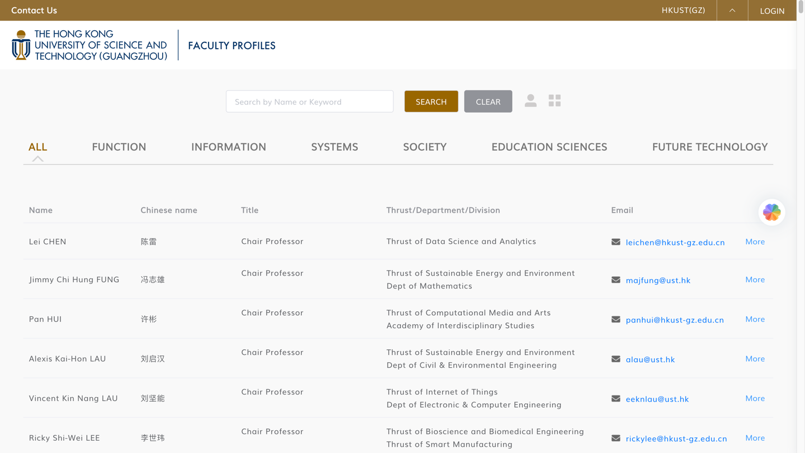
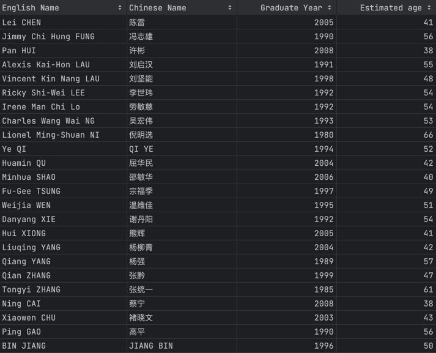

# HKUST-GZ-Faculty-EDA

This repository contains two Python scripts, `crawl.py` and `analysis.py`, for extracting and analyzing data related to faculty members from the [HKUST-GZ Faculty Profiles](https://facultyprofiles.hkust-gz.edu.cn/) website. These scripts help you gather information about faculty members and perform exploratory data analysis on the collected data.



## Contents

1. [crawl.py](crawl.py)
   - This script is responsible for crawling faculty information from the HKUST-GZ Faculty Profiles website.
   - It uses web scraping techniques and the Selenium library to collect detailed faculty information, including names, titles, research interests, and more.
   - The extracted data is then saved into CSV files (`faculty_table.csv` and `faculty_grad_year.csv`).

2. [analysis.py](analysis.py)
   - This script is used to analyze the data collected by `crawl.py`.
   - It performs basic exploratory data analysis (EDA) and creates visualizations to better understand the faculty data.
   - Visualizations include faculty titles distribution, research interests distribution, faculty ages distribution, department and title distribution, and word clouds for research interests and faculty overviews.

## Data Columns

### [faculty_table.csv](faculty_table.csv) Data Columns:

1. `English Name`: English name of faculty members.
2. `Chinese Name`: Chinese name of faculty members.
3. `Title`: Title or position of faculty members.
4. `Thrust/Department/Division`: Research thrust, department, or division to which faculty members belong.
5. `Email`: Email addresses of faculty members.
6. `Location`: Work location of faculty members.
7. `Overview`: Personal overview or summary of faculty members.
8. `Research Interest`: Research interests of faculty members.
9. `Homepage`: Personal homepage links of faculty members.
10. `More`: Detailed information links for faculty members.

### [faculty_grad_year.csv](faculty_grad_year.csv) Data Columns:

1. `English Name`: English name of faculty members.
2. `Chinese Name`: Chinese name of faculty members.
3. `Graduate Year`: Year in which faculty members graduated.
4. `Estimated age`: Estimated age of faculty members (calculated based on graduation year, assuming the current year is 2023).

## Exploratory Data Analysis (EDA) Visualizations

In the data exploratory analysis (EDA) process, the following visualizations were generated to gain insights into the faculty data:

1. **Faculty Titles Distribution**:
   - Left: Horizontal bar chart showing the distribution of faculty titles.
   - Right: Donut chart displaying the proportion of different titles among faculty members.

2. **Research Interests Distribution**:
   - Includes a bar chart for the top 10 research interests and a pie chart for the top 6 research interests.
   - The bar chart displays the distribution of research interests in terms of quantity.
   - The pie chart shows the percentage distribution of the top 6 research interests.

3. **Faculty Ages Distribution**:
   - Histograms for graduate years and estimated ages are displayed side by side.
   - The graduate year histogram shows the distribution of faculty graduation years.
   - The estimated age KDE (Kernel Density Estimation) plot shows the distribution of estimated ages, including mean and median lines.

4. **Department and Title Distribution**:
   - Left: Horizontal bar chart displaying department distribution.
   - Right: Grouped bar chart illustrating the distribution of titles within departments.

5. **Word Clouds for Research Interests and Faculty Overviews**:
   - Word clouds representing common words in faculty research interests and overviews are displayed.

These visualizations provide valuable insights into the distribution of faculty titles, research interests, ages, department and title distribution, and the frequency of keywords in research interests and personal overviews. These analyses and visualizations aid researchers and decision-makers in understanding the characteristics and research directions of the faculty members.

## Getting Started

1. Clone the repository:

   ```
   git clone https://github.com/your-username/HKUST-GZ-Faculty-EDA.git
   cd HKUST-GZ-Faculty-EDA
   ```

2. Install the required Python libraries if you haven't already:

   ```
   pip install pandas requests beautifulsoup4 selenium loguru wordcloud matplotlib numpy seaborn
   ```

3. Execute the data crawling script `crawl.py` to collect faculty information:

   ```
   python crawl.py
   ```

   This script will generate two CSV files: `faculty_table.csv` and `faculty_grad_year.csv`.

4. Execute the data analysis script `analysis.py` to perform exploratory data analysis and generate visualizations:

   ```
   python analysis.py
   ```

   The script will create visualizations in the `visualization` directory and display them.

## Dependencies

- Python 3.x
- Pandas
- Requests
- BeautifulSoup4
- Selenium
- Loguru
- WordCloud
- Matplotlib
- NumPy
- Seaborn

Please make sure you have the required dependencies installed before running the scripts.

**Note:** The data used in this analysis may be outdated if the HKUST-GZ Faculty Profiles website has been updated since the knowledge cutoff date in September 2021. You may need to modify the scripts to adapt to any changes in the website structure if necessary.